# Terminal Portfolio Website by Rakesh Patel


My portfolio website in terminal version, developed with React, TypeScript and Styled-Components. Multiple themes are supported and keyboard shortcuts can be used for some functionalities.

Live site: https://shell.rakeshpatel.me/

## Features

- Responsive Design 📱💻
- Multiple themes 🎨
- Autocomplete feature ✨ (TAB | Ctrl + i)
- Go previous and next command ⬆️⬇️
- View command history 📖
- PWA and Offline Support 🔥
- Well-tested ✅

## Tech Stack

**Frontend** - [React](https://reactjs.org/), [TypeScript](https://www.typescriptlang.org/)
**Styling** - [Styled-Components](https://styled-components.com/)
**Build** - [Vite](https://vitejs.dev/)
**State Management** - [ContextAPI](https://reactjs.org/docs/context.html)
**Testing** - [Vitest](https://vitest.dev/), [React Testing Library](https://testing-library.com/)

## Commands

Type `help` in the terminal for the full list.

| Command | Description |
| --- | --- |
| `about` | About Rakesh Patel |
| `education` | Education background |
| `projects` | Projects and their live links |
| `socials` | Social accounts |
| `themes` | Switch between the 6 available themes |
| `email` | Open the default mail app |
| `gui` | Open the non-terminal portfolio site |
| `history` | View command history |
| `whoami` | Current user |
| `clear` / `echo` / `help` | Standard terminal utilities |

The list above is the polite version. There are 21 hidden commands that are not
in `help`, not in Tab autocomplete, and refused by `man`. The full breakdown,
including all of them, is in [docs/COMMANDS.md](docs/COMMANDS.md), which is
generated from the command registry.

## Multiple Themes

Currently, this website supports 6 themes: `dark`, `light`, `blue-matrix`, `espresso`, `green-goblin` and `ubuntu`. Type `themes` in the terminal for more info.

## Lighthouse Score

<p align="center">

</p>

## Running Locally

Clone the project

```bash
git clone https://github.com/rakeshPatel-Dev/terminal-portfolio.git
```

Go to the project directory

```bash
cd terminal-portfolio
```

Remove remote origin

```bash
git remote remove origin
```

Install dependencies

```bash
npm install
```

Start the server

```bash
npm run dev
```

Run tests

```bash
npm run test:once
```

## Inspiration and Credits

This project is a fork of [satnaing/terminal-portfolio](https://github.com/satnaing/terminal-portfolio), an MIT licensed project. The original author and all contributors are credited below. Inspiration for this kind of terminal website also came from:

- [term m4tt72](https://term.m4tt72.com/)
- [Forrest](https://fkcodes.com/)

## License

MIT — see [LICENSE](./LICENSE). Original project copyright © 2024 Sat Naing.

## Author

- [@rakeshPatel-Dev](https://github.com/rakeshPatel-Dev)
